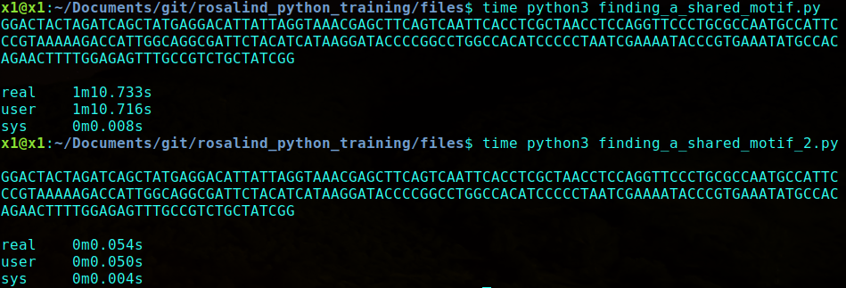

# rosalind_python_training

Using the rosalind.info site for bioinformatic programming to sharpen my python and mathematical skills. The link for each problem will bring you to the problem prompt on the rosalind.info site, and the link for each solution will bring you to my solution in this repository.

[**Counting DNA Nucleotides**](http://rosalind.info/problems/dna/) -- [counting_dna_2.py](files/counting_dna_2.py)

[**Transcribing DNA into RNA**](http://rosalind.info/problems/rna/) -- [transcribing.py](files/transcribing.py)

[**Completing a Strand of DNA**](http://rosalind.info/problems/revc/) -- [complimentary_dna.py](files/complimentary_dna.py)

[**Rabbits and Reccurrence Relations**](http://rosalind.info/problems/fib/) -- [reccurrence_relations.py](files/reccurrence_relations.py)

[**Computing GC Content**](http://rosalind.info/problems/gc/) -- [gc_content_2.py](files/gc_content_2.py) -- features use of the **split** and **join** commands

[**Counting Point Mutations**](http://rosalind.info/problems/hamm/) -- [hamming_distance_2.py](files/hamming_distance_2.py) -- makes use of the **zip** and **count** commands

[**Mendel's First Law**](http://rosalind.info/problems/iprb/) -- [mendels_first_law_2.py](files/mendels_first_law_2.py) -- Mendel's first law states that for any factor, an individual randomly assigns one of its two alleles to its offspring. This program also allowed me to get reaquanited with combinatorics.

[**Translating RNA into Protein**](http://rosalind.info/problems/prot/) -- [rna_to_protein_2.py](files/rna_to_protein_2.py) -- features use of the **zip** command as well as using it to form key-value pairs to intialize a dictionary

[**Finding a Motif in DNA**](http://rosalind.info/problems/subs/) -- 
                          [dna_motifs.py](files/dna_motifs.py) -- features the use of regular expressions including 
                                                                  lookahead assertionss
                          [dna_motifs_2.py](files/dna_motifs_2.py) -- features the use of the **str.find()** function with the
                                                                  optional offset argument **str.find(string,offset)**
                          [dna_motifs_3.py](files/dna_motifs_3.py) -- very simple, pythonic and readble, makes use of the 
                                                                      **str.startswith(string)** function
                                                                      
[**Consensus and Profile**](http://rosalind.info/problems/cons/) -- [consensus_and_profile.py](files/consensus_and_profile.py) -- Was reminded that strings can be accessed as arrays in this one, as well as encountering accidental overwriting of duplicated arrays. CANNOT use \[\[0]\*ncol]\*nrow to make a 2d array, must use \[\[0]\*ncol for i in range(nrow)]      

[**Mortal Fibbonacci Rabbits**](http://rosalind.info/problems/fibd/) -- 
                            [mortal_fib_rabbits.py](files/mortal_fib_rabbits.py) -- A simple solution independently tracking the amount of baby rabbit pairs or "little" rabbits and mature rabbits pairs or "big" rabbits                                                                                                                  
                                       [mortal_fib_rabbits_2.py](files/mortal_fib_rabbits_2.py) -- A less straightforward but more efficient solution in which an array tracks the ages of each pair of rabbits, with the total number of living rabbits being the sum of the array elements.

[**Overlap Graphs**](http://rosalind.info/problems/grph/) -- [overlap_graphs.py](files/overlap_graphs.py) -- A brief refresher on graphs while being an introduction to me about the bioinformatics topic of **overlap graphs**

[**Calculating Expected Offspring**](http://rosalind.info/problems/iev) -- [calculating_expected_offspring.py](files/calculating_expected_offspring.py) -- a short and simple program but features the smart use of mapping the list of number of genotype parents to a list of probabilities of those parents having a phenotype dominant child using the **zip** function

[**Finding a Shared Motif**](http://rosalind.info/problems/lcsm/) -- [finding_a_shared_motif.py](files/finding_a_shared_motif.py) -- A simple and inefficient program to find the longest common subsequence by searching through all possible combinations                                                 
[finding_a_shared_motif_2.py](files/finding_a_shared_motif_2.py) -- A much smarter implementation to find the largest commmon subsequences of an array of sequences, this method uses **binary search** to search the possible sizes for the largest possible subsequence shared by the list. Difference in run time can be seen below, with the first implementation taking 1min 10s and the second implementation taking 0min .5s

[**Mendels Second Law**](http://rosalind.info/problems/lia/) -- [mendels_second_law.py](files/mendels_second_law.py) -- I must honestly say this one stumped me for a while. After playing around with the probabilities I ended up on something that looked very familair as it was the binomial distribution! This program features the use of the **scipy** library for combinations, and a comment in the program shows how I could use the binomial CDF from the scipy library 

[**Finding a Protien Motif**](http://rosalind.info/problems/mprt/) -- [finding_a_protein_motif.py](files/finding_a_protein_motif.py) -- A helpful introduction into the protein database **UniProt** "which provides detailed protein annotation, including function description, domain structure, and post-translational modifications. UniProt also supports protein similarity search, taxonomy analysis, and literature citations.". This program also features the use of **urllib** to access the protein FASTA through Uniprot. Also another opportunity to brush up on **regular expressions**, learning that \[^P] can be used to can be used to specify NOT P in the next position, and again making use of **lookahead expressions** with (?=) to allow for overlapping expressions. 

[**Inferring mRNA from Protein**](http://rosalind.info/problems/mrna/) -- [inferring_mrna_from_protein.py](files/inferring_mrna_from_protein.py) -- A simple program to calculate the number of possible mRNA strings that could have generated the protein (mod 1,000,000). One important thing learned while surfing the solutions wiki is that **In modern versions of Python, integers grow as needed without bound, limited only by memory**.

[**Open Reading Frames**](http://rosalind.info/problems/orf/) -- [open_reading_frames.py](files/open_reading_frames.py) -- Introduced me to the concept of **open frames**, being the idea that DNA/RNA can be read one of six ways to produce the end protein result (three for one strand and three for the reverse compliment). This program deals with everything from dictionaries to more advanced splicing techniques and makes use of a ton of **list comprehensions**, as these are the starts of python. During this implementation I became curious about the efficiency of appending to a string (which really creates a new string each time as strings are immutable) vs. the efficience of creating a character list and joining all the characters after appending all necesary characters. I found [this great post](https://stackoverflow.com/questions/1349311/python-string-join-is-faster-than-but-whats-wrong-here) which shows that for some small cases, string appending is faster but **in general one should always use lists with append() and if a string is needed use ''.join(list)**. It was found that appending all of the same characters to a list compared to a string takes about 10% of the time, but the final step of ''.join() makes the processing time comparable, so in general **Lists are much more efficient than strings in Python, so if a list can be used instead of a string, USE A LIST**. This program also makes use of **enumerate(list)**, which forms tuples of the indices of the elements of a list with the elements of a list, in that order. 
